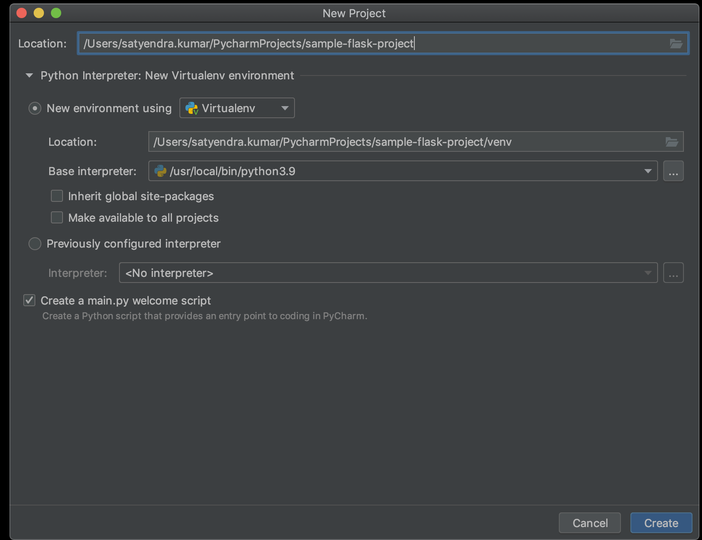
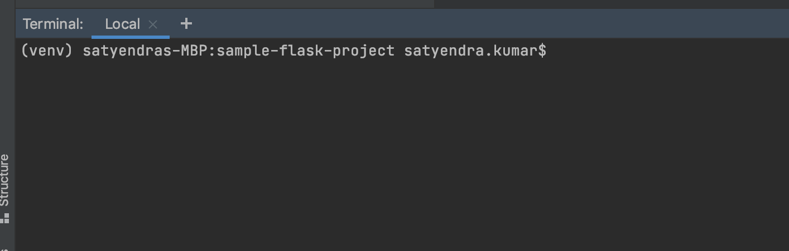

# sample-flask-project

1. [Install PyCharm](https://www.jetbrains.com/pycharm/download/)
   and create a new project. 
   
   (You can always view/change python interpreter later if you want, Press double shift key, enter `python interpreter` to open `Preferences > Project Interpreter` window.)

2. Open terminal in the PyCharm itself (Press 'Alt+F12' keys)
    You'll see (venv) on the terminal before your username, which means that you will now be running commands within Virtual Environment created earlier.
   
   (Note: using external terminal would be more cumbersome)
3. Create requirements files, and sample test file.
4. Install packages/libraries by running command `pip install -r requirements/development.txt` on terminal.
5. Run `pytest` command on terminal.